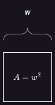
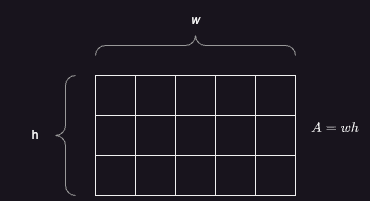
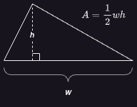
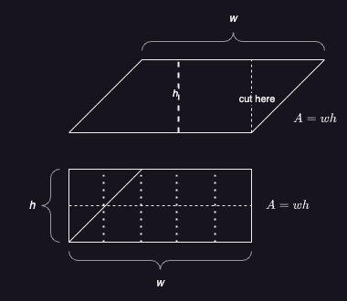
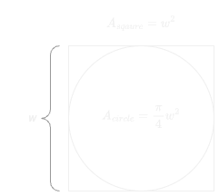

# A Circle in a Square

## A Story We All Know

In grade school, we all learned the principal formulas about circles:

$$
C = 2 \pi r = \pi d  \\
A = \pi r^2
$$

Where $C$ is the circumference (that is the perimeter for most other shapes), $A$ is the area, $r$ is the radius, and $d$ is the diameter of the circle.

The common item to all these equations is the mathematical constant $\pi$. But if you ask most people, "what is $\pi$?" their answers will usually be something like "about 3.14" or "a number that goes on forever." The closest thing you'll get to mentioning a circle is, "it's the circle number." While $\pi$ has served us well as a civilization, the fact that it feels to most of us like a random number associated with circles can be unsatisfying. In particular, there is no informative answer to "What does $\pi$ actually tell you about a circle?"

## A More Technical Story

Now those with a more technical knowledge of mathematics will argue that we know exactly what $\pi$ tells us about a cirlce.

> $\pi$ is the ratio of the circumference of a circle to the diameter of that circle.

While this is technically true, it does not tell us anything about how a circle relates to other shapes. It does not reveal any deeper meaning, because it is completely defined in terms of the circle, and does build our knowledge of the circle from any prior knowledge.

This is not to say that $\pi$ has not served us well as a civilization, but it certainly leaves something to be desired when you are trying to understand what a circle is and how it fits into the grand scheme of things.

## A Quick Review of Areas

If you remember the technicalities of geometry, you will remember that the area of a shape is the number of squares with sides of length 1 that are necessary to fill the shape. Immediately we are to the heart of the matter, that all 2-dimensional shapes are, to some extent, understood interms of the square.

A square with sides of length $w$ can be thought of as a grid $w$ wide and $w$ high of squares of length 1. Based on that we have the old formula: $A_{square}=w^2$.

Similarly, a rectangle that has one side with length $w$ and one side with length $h$, can be thought of as a grid $w$ wide and $h$ high of squares of length 1. Again, we arrive at the familiar formula $A_{rectangle}=wh$.

Next, at least for me, came triangles. We were told that $A_{triangle}=\frac{1}{2}wh$, where $w$ is the width of the triangle and $h$ is its height from the side of length $w$ to the opposite vertex.

If you happened to ask why this formula was true, often you would get the run around, because you didn't know enough to answer the question.

### Parallelograms

While we tend not to encounter them as often in real life, parallelogram's probably should have been taught before triangles. The have the nice formula $A_{parallelogram}=wh$ where $w$ is the length of one set of parallel sides, and $h$ is the height, or distance between those two sides. This formula makes perfect sense if we simply cut the parallelogram and rearrange it into the rectangle of the same dimensions. So again, we have a shape whose area is measured as a grid of squares.

Now back to triangles. The formula we have for the area of a triangle comes from parallelograms. If we take a triangle, and make a mirror copy across one of the sides with length other than $w$, we get a total shape that is a parellelogram with one set of parallel sides with length $w$ and with height $h$. A triangle is just half of that shape.

What this all goes to show is that when trying to understand the area of a shape, we always fall back to squares. **Except** when we are dealing with circles.

## We Treat Circles Differently

For all the shapes we discussed above, we measure lengths of those shapes as distances between points on the boundary of the shape. But if we look back to our equations for circles, notice that the most common forms all use the circles radius, which is not the distance between points on the edge of the circle, but the distance from the center to the edge. It was this observation that led me down this rabbit hole. What if instead of using radius, we stuck to diameter, which is distance between two points on the edge of a circle?

## Yet Another Circle Constant

Pretend our circle has a diameter of $w$. We are using $w$, because diameter is just a special kind of width, and as we will see, it is not just the width of a circle. Then with a little algebra we have:

$$
A_{circle}=\pi r^2 \\
    = \pi (\frac{w}{2})^2 \\
    = \frac{\pi}{4} w^2
$$

At first this reformulation does not seem too interesting, but there are two things to note. First, $w^2$ is the area of a square with the same width as our circle. Second, unlike when we work with a radius, the constant $\frac{\pi}{4}$ is less than 1. This makes it easy to interpret the circle as a percentage or fraction of a square of the same dimensions. I find it helps to picture this as the circle circumscribed by the square of the same size. In particular, while $\pi$ lacks any meaning except in the context of a circle, we can say that given a circle and square of width $w$, $\frac{\pi}{4}$ is the fraction of the area of the square that the circle occupies.

Because $\pi$ is the 16th letter of the Greek alphabet and $\delta$ is the fourth, we will use the alias

$$
\delta=\frac{\pi}{4}\approx0.785398
$$

With this interpretation and alias we have:

$$
A_{circle}=\delta w^2 \\
=\delta A_{square}
$$

## Down the Rabbit Whole

This is all fine and good for area, but why name a value that is only good in one circumstance? Again pretend we have a square and a circle who both have a width of $w$. We know that the perimeter of the square is given by $P_{square}=4w$. Using the fact that $\delta=4\pi$ and $P_{circle}=\pi w$, we arrive at the new formula $P_{circle}=4\delta w$. Again, at first you might be thinking this isn't very interesting, but with a little algebra we see:

$$
P_{circle} = \delta (4w) \\
= \delta P_{square}
$$

Astonishingly, not only does $\delta$ naturally appear again in the context of perimeter, but it appears in the exact same relationship. Both the perimeter and area of a circle are the fraction $\delta$ times the similar property of an equally sized square!

A little digging will also who us $\delta$ maintains a similar area relationship for the area of an ellipses to the circumscribing rectangle. However, this is not true for perimeter of perimeter of ellipses. In fact, the perimeter of an ellipse is not a fixed constant of the perimeter of the circumstribing rectangle.

## What About Higher Dimensions

Let's take a moment to see how $\delta$ impacts our values for spheres.

For the remainder of this section, we will work with a circle of radius $r$ and diameter $w=2r$ as well as cube of side length $w$. Additionally, recall the relationship $\pi=4\delta$.

The volume of the cube follows the traditional formula $V_{cube}=w^3$.

The volume of the sphere is

$$ V_{sphere} = \frac{4}{3}\pi r^3 = \frac{2\delta}{3}w^3 = \frac{2\delta}{3} V_{cube} $$

Let's see what happens with surface area before we hit much discussion.

The surface area of a square is given by $S_{square}=6w^2$.

For a sphere we have 

$$ S_{sphere}=4\pi r^2 = 4\delta w^2 $$
Now, to jump a bit to the conclusion, the volume relationship suggests that in three dimensions the "sphere constant" should be $\frac{2\delta}{3}$. A little algebra gives us

$$ S_{sphere} = \frac{2\delta}{3} 6w^2 = \frac{2\delta}{3}S_{cube} $$

In other words, $\delta$ defines a constant relationship not only between circles and equally wide squares but spheres and equally sized cubes.

In fact, we can find a similar relationship for any higher dimensional n-sphere and n-cube of equal widths.

$$ V_{n-sphere}=\frac{\delta^\frac{n}{2}}{\Gamma(\frac{n}{2} +1)} V_{n-cube} $$

and then

$$ S_{n-sphere}=\frac{\delta^\frac{n}{2}}{\Gamma(\frac{n}{2} +1)} S_{n-cube} $$

Where $\Gamma$ is the gamma function, which can be thought of as an extension of factorial to all positive real numbers. Of particular note is that the use of delta actually makes the formulas for n-spheres cleaner, removing several seemingly arbitrary factors that appear when using $\pi$.